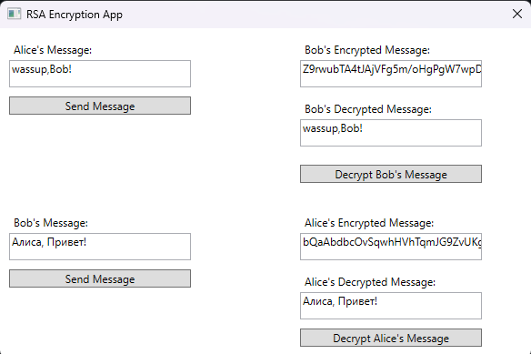

# 🔐 RSA Encryption App  

## 💻 Интерфейс  

- В левой части окна — поля для ввода и отправки сообщений от Алисы и Боба  
- В правой части — поля для отображения зашифрованных и расшифрованных сообщений  
- Кнопки позволяют отправлять и расшифровывать сообщения  

  

  

---

## 🚀 Описание  

**RSA Encryption App** — учебное WPF-приложение на C#, демонстрирующее работу асимметричного шифрования RSA на примере обмена сообщениями между Алисой и Бобом.  

✨ **Возможности:**  
- 🔒 Шифрование сообщений открытым ключом получателя  
- 🔓 Дешифрование закрытым ключом  
- 📚 Наглядная демонстрация работы RSA  

## 🔧 Принцип работы  

1. 🗝️ Каждый пользователь имеет пару ключей (публичный/приватный)  
2. ✉️ Сообщение шифруется публичным ключом получателя  
3. 🔏 Расшифровка происходит приватным ключом получателя  

## 🏁 Запуск  

1. Откройте проект в Visual Studio 2019+  
2. Соберите и запустите `RSA/MainWindow.xaml`  
3. Используйте интерфейс для обмена зашифрованными сообщениями  

---

### 🛠 Технологии  

- **Язык:** C#  
- **Платформа:** .NET Framework 4.7.2  
- **UI:** WPF/XAML  
- **Криптография:** RSACryptoServiceProvider  

---

🎓 *Учебное приложение для демонстрации работы RSA*
